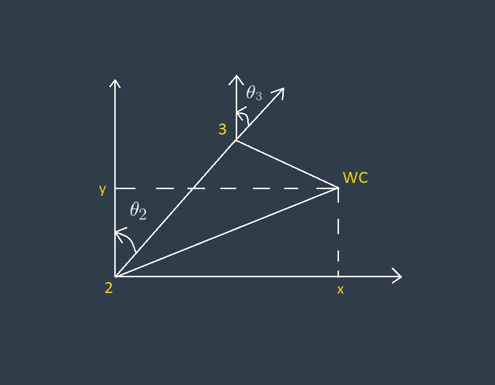

[](https://www.udacity.com/robotics)
# Robotic arm - Pick & Place project

## Contents :
1. Setting up the environment
2. Installation
3. Forward Kinematics
4. Inverse Kinematics
5. Screenshots

# 1- Setting up the environment:

I have used the robo-nd VM  to run this project.

# 2- installation steps:

* Clone this repository to your home directory:
```sh
$ git clone https://github.com/AhmdNassar/Robotic-Arm-Pick-Place.git ~/catkin_ws 
```

* As this project uses custom Gazebo 3D models, we need to add the path through environment variable: 
```sh
$ echo "export GAZEBO_MODEL_PATH=~/catkin_ws/src/kuka_arm/models" >> ~/.bashrc
```

* Install missing ROS dependencies using the `rosdep` install command:
```sh
$ cd ~/catkin_ws/
$ rosdep install --from-paths src --ignore-src --rosdistro=kinetic -y
```

* Run catkin_make from within your workspace to build the project:
```sh
$ cd ~/catkin_ws/
$ catkin_make
```
* Now from a terminal window:

```sh
$ cd ~/catkin_ws
$ rosdep install --from-paths src --ignore-src --rosdistro=kinetic -y
$ cd ~/catkin_ws/src/RoboND-Kinematics-Project/kuka_arm/scripts
$ sudo chmod +x target_spawn.py
$ sudo chmod +x IK_server.py
$ sudo chmod +x safe_spawner.sh
```

* Run the following shell commands to source the setup files:
```sh
$ echo "source ~/catkin_ws/devel/setup.bash" >> ~/.bashrc
```

* For demo mode make sure the demo flag is set to `true` in `inverse_kinematics.launch` file under `~/catkin_ws/src/kuka_arm/launch/`


* You can also control the spawn location of the target object in the shelf by modifying the spawn_location argument in `target_description.launch` file under `~/catkin_ws/src/kuka_arm/launch/`. 0-9 are valid values for spawn_location with 0 being random mode.

* To run forward kinematics test us:
```sh
$ roslaunch kuka_arm forward_kinematics.launch
```

* To run simulator use:
```sh
$ rosrun kuka_arm safe_spawner.sh
```

* To run IK Server use:
```sh
$ rosrun kuka_arm IK_server.py 
```

# 3 - Forward Kinematic Analysis
We use the forward kinematics to calculate the final coordinate position and rotation of end-effector

## 1 - Extracting joint positions and orientations from URDF file.

from the URDF file `kr210.urdf.xacro` we can extract the position xyz and orientation rpy of each joint from **origin** tag in each joint XML section:

for example, from the following fixed base joint XML section:

```xml
 <!-- joints -->
  <joint name="fixed_base_joint" type="fixed">
    <parent link="base_footprint"/>
    <child link="base_link"/>
    <origin xyz="0 0 0" rpy="0 0 0"/>
  </joint>
```
Following table is showing Denavit - Hartenberg DH parameters

i | alpha | a | d | theta
---- | ---- | ---- | ---- | ----
1 | 0 | 0 | 0.75 | theta_1
2 | -pi/2 | 0.35 | 0 | theta_2 - pi/2
3 | 0 | 1.25 | 0 | theta_3
4 | -pi/2 | -0.054 | 1.5 | theta_4
5 | pi/2 | 0 | 0 | theta_5
6 | -pi/2 | 0 | 0 | theta_6
7 | 0 | 0 | 0.303 | theta_7

### Now we able to know each joint position and extract an image for the robot building the DH diagram. 


## 2 - define our symbols.

```python
q1, q2, q3, q4, q5, q6, q7 = symbols('q1:8')
d1, d2, d3, d4, d5, d6, d7 = symbols('d1:8')
a0, a1, a2, a3, a4, a5, a6 = symbols('a0:7')
alpha0, alpha1, alpha2, alpha3, alpha4, alpha5 , alpha6 = symbols('alpha0:7')
```
### and define dictionary for DH parameters...

```python
s = {alpha0:     0,  a0:     0,  d1:   0.75,
     alpha1: -pi/2,  a1:  0.35,  d2:      0, q2:  q2-pi/2,
     alpha2:     0,  a2:  1.25,  d3:      0,
     alpha3: -pi/2,  a3:-0.054,  d4:    1.5,
     alpha4:  pi/2,  a4:     0,  d5:      0,
     alpha5: -pi/2,  a5:     0,  d6:      0,
     alpha6:     0,  a6:     0,  d7:  0.303, q7:     0}
```

## 4 -Creating the individual transformation matrices about each joint
to describe the relative translation and orientation of link (i-1) to link (i)


Homogenous Transforms function

```python
def matrix(alpha, a, d, q):
    ans = Matrix([[             cos(q),            -sin(q),            0,              a],
                     [  sin(q)*cos(alpha),  cos(q)*cos(alpha),  -sin(alpha),  -sin(alpha)*d],
                     [  sin(q)*sin(alpha),  cos(q)*sin(alpha),   cos(alpha),   cos(alpha)*d],
                     [                  0,                  0,            0,              1]])
    return ans
```
Then using the following code to substitute the DH parameters into the transformation matrix:

```python
T0_1 = matrix(alpha=alpha0, a=a0, d=d1, q=q1)
T1_2 = matrix(alpha=alpha1, a=a1, d=d2, q=q2)
T2_3 = matrix(alpha=alpha2, a=a2, d=d3, q=q3)
T3_4 = matrix(alpha=alpha3, a=a3, d=d4, q=q4)
T4_5 = matrix(alpha=alpha4, a=a4, d=d5, q=q5)
T5_6 = matrix(alpha=alpha5, a=a5, d=d6, q=q6)
T6_G = matrix(alpha=alpha6, a=a6, d=d7, q=q7)

T0_1 = T0_1.subs(s)
T1_2 = T1_2.subs(s)
T2_3 = T2_3.subs(s)
T3_4 = T3_4.subs(s)
T4_5 = T4_5.subs(s)
T5_6 = T5_6.subs(s)
T6_G = T6_G.subs(s)

```
To get the composition of all transforms from base to gripper we simply multiply the individual matrices using the following code:

```python
# Composition of Homogeneous Transforms
# Transform from Base link to end effector (Gripper)
T0_2 = simplify(T0_1 * T1_2)
T0_3 = simplify(T0_2 * T2_3)
T0_4 = simplify(T0_3 * T3_4)
T0_5 = simplify(T0_4 * T4_5)
T0_6 = simplify(T0_5 * T5_6)
T0_G = simplify(T0_6 * T6_G)
```

## 4 - we have to Compensate for rotation discrepancy between DH parameters and Gazebo
```python

def rot_x(angle):
	R_x = Matrix([[     1,                0,               0,     0],
                  [     0,       cos(angle),     -sin(angle),     0],
				  [     0,       sin(angle),      cos(angle),     0],
				  [     0,                0,               0,     1]])
	return R_x

def rot_y(angle):
	R_y = Matrix([[    cos(angle),                0,    sin(angle),     0],
					[             0,                1,             0,     0],
					[   -sin(angle),                0,    cos(angle),     0],
					[             0,                0,             0,     1]])
	return R_y

def rot_z(angle):
	R_z = Matrix([[       cos(angle),      -sin(angle),          0,      0],
				  [       sin(angle),       cos(angle),          0,      0],
				  [                0,                0,          1,      0],
				  [                0,                0,          0,      1]])
	return R_z

R_corr = simplify(rot_z(pi) * rot_y(-pi/2))
```
now we are able to get the position of the end-effector depending on the different theta angles.

# 3 - Inverse Kinematics

### 1. first we have to get the end-effector position and the rotation matrix for it as following:
```python
R_EE = rot_z(yaw)[0:3,0:3] * rot_y(pitch)[0:3,0:3] * rot_x(roll)[0:3,0:3] * R_corr[0:3,0:3]
EE_Position = Matrix([[px],[py],[pz]])

WC = EE_Position - 0.303 * R_EE[:,2] 
```
### 2. Since the last three joints in our robot are revolute and their joint axes intersect at a single point, we have a case of spherical wrist with joint_5 being the common intersection point and hence the wrist center.

This allows us to kinematically decouple the IK problem into `Inverse Position` and `Inverse Orientation`

### 3. first `Inverse Position` 
for the first angle theta_1, it is between x-axis and y-axis we can use tan inverse to get it

```python
theta_1 = atan2(WC[1],WC[0])
```




```python
new_wx = sqrt(WC[0]**2 + WC[1]**2) - 0.35
new_wz = WC[2] - 0.75 # WC_Z - d1
B = sqrt(new_wx**2 + new_wz**2)

# A and C fixed length from urdf
C = 1.25
A = 1.5

# cos(a) = (B^2 + C^2 - A^2) / (2* C * A)
angle_a = math.acos(( pow(B,2) + pow(C,2) - pow(A,2) ) / ( 2 * B * C ))
theta_2 = pi/2 - angle_a - atan2(new_wz,new_wx)

# to get theta 3 we have to calculate angle_b first as follows:-
angle_b = math.acos((pow(C,2) + pow(A,2) - pow(B,2)) / (2 * C * A))
theta_3 = pi/2 - angle_b - 0.03598 # 0.03598 is fixed angle = atan2(0.054,1.5)

```

### 4. for the `Inverse Orientation` to calculate the last three angles
we have to calculate the rotation matrix between base link and joint 3 = R0_3 then we are able to calculate R3_6


```python
T0_2 = simplify(T0_1 * T1_2)
T0_3 = simplify(T0_2 * T2_3)

R0_3 = T0_3.evalf(subs={q1: theta_1, q2: theta_2, q3: theta_3})[0:3,0:3]

R3_6 = R0_3.inv("LU") * R_EE
```
now we can calculate the last three joints from the matrix `R3_6`


```python
theta_4 = atan2(R3_6[2, 2], -R3_6[0, 2])
theta_5 = atan2(sqrt(R3_6[0, 2]*R3_6[0, 2]+R3_6[2, 2]*R3_6[2, 2]), R3_6[1, 2])
theta_6 = atan2(-R3_6[1, 1], R3_6[1, 0])
```
# 5 - Screenshots 


